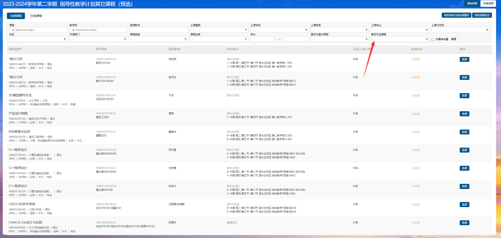

特别鸣谢：[AzeniaX](https://github.com/AzeniaX)

## 如何进入选课系统

大连理工大学学生综合教学管理系统：[http://jxgl.dlut.edu.cn/student/home](http://jxgl.dlut.edu.cn/student/home)

登录系统后下拉，这些是我们选课阶段会用到的：

点击 **学生选课**，即可进入选课系统。

## 选课阶段

### 选课预览

在每年选课期的最初一到两天，选课系统提前开放。此时可以提前预览本学期开设的课程。

### 预选

在选课期的最初一周左右时间是预选阶段。在该阶段内，所有课程不限人数，选课不分时间先后，不含重修复修选课。

每人会被分配 **100 意愿值**，可自由分配。预选阶段结束后，结合预选课程情况，系统将对报名人数大于课堂容量的课程进行自动抽签，此时意愿值越高，被抽中的概率越大（只是提高权重，意愿值 100 也有可能选不上，意愿值 0 也有可能选上）。届时将有部分学生被退出课堂。预选的课程情况并不是最终的选课结果，务必请在正选阶段核实自己的选课结果。

### 正选

在预选阶段结束后将会开启正选阶段。正选阶段时期可以查看自己预选阶段后成功选上和未被抽上的课程，并确认自己的选课情况。除此之外，在本阶段有课余量的课程可以继续选择。正选阶段所有课程限定容量，按照先选先得的原则进行。为避免课程买卖等行为，学校系统会将退课等释放的课程容量于每天中午 12:00 定时释放。

### 补退选

在新学期开学前的一周到教学周的前两周是补退选阶段。在该时间段内可以进行重修/复修选课、国内外交流等学籍异动学生选课及本研衔接选修课程选课、本科生选研究生课程。在补退选阶段，因为转专业、重修等原因导致课程冲突的学生可以进行冲突选课申请。除此之外，如果不想上的课程也可以在此阶段随时退课。在此阶段，部分课程视情况会增加一定课容量，可根据自己的实际情况进行补退选。

## 预选阶段攻略

在预选阶段所有课程不限人数，选课不分时间先后，因此不需要着急，在预选的几天内合理安排时间选课即可。

预选阶段进行的是必修和公共选修课的选择。开发区校区的体育课在正选阶段进行抢课，预选阶段的体育课只是随机分配的占坑课程，在预选阶段结束后自动退掉，无需在意。

### 班级课表

首先，我们要认识班级课表，在教务系统找到“我的班级课表”，点击进入即可看到以行政班为单位安排的班级课表。

这张课表是教务预先安排好的，包含了全部的本学期建议修读的必修课，并且已经分配好了教学班和老师。因此，对于必修课程，我们只需要对照班级课表上面的课程依次选择即可。

### 选课系统

点开选课系统，我们可以看到有很多项，它们分别对应了不同的课程。

- **主校区和开发区大三的体育选课**，大一大二可以无视。
- **大学英语分级选课**，根据你入学英语考试的分级情况进行后续的大英选课。
- **指导性教学计划其它课程（预选）**，我们的必修课在这里选择。
- **毕业设计(论文)选课**，大一大二可以无视。
- **全校通识类、创新创业教育课及公共选修课**，我们的通识课和选修课在这里选择。

点击其中一项进入之后，会看到这样的界面。上面的各项索引请妥善使用，能帮助你更快找到课程。

如果看不到课程，记得检查“是否可选课程”这一项，将其改为可选即可。使用列表选课选择结束后，可以点击右上角的课表选课，检查自己所选课程的排列情况。

注意：在哪一项里面选择的课程就要在哪一项里面取消。如果无法退课，查看自己这门课是不是在这个项目里面选择的。例如，在指导性教学计划其它课程里面选择的课程，在其他选课项目里面是无法退课的，此时只需要回到指导性教学计划那一项里面就可以正常退课了。

### 意愿值

在预选阶段，每个人会被分配到 **100 意愿值**，意愿值可以在课程超过容量时增大自己被选中的概率（只是增加概率，有时即使分配了 100 意愿值也可能选不上）。

对于班级课表里面的必修课来说，意愿值分配 **0** 即可，如果实在担心掉课，可以分配 **1-5 意愿值**。意愿值主要用在选修课和劳动课等的抽选，由于开发区劳动 2 课程容量极其有限，美育课只有音乐鉴赏一个，因此抢这两门课程很多时候 100 意愿值也难选上。无数学长从大一掉课掉到大三。因此，请珍惜你选上的选修课和意愿值。

### 选课思路

首先，我们要知道预选阶段的两个前提：

1. 预选阶段不可以有时间冲突的课程。
2. 预选阶段部分学院和课程规定不能跨教学班选课。

并且预选阶段选课不分先后，因此主要是策略问题。

#### 必修课

对于必修课，我们直接先按照班级课表选课，并且意愿值给 **0** 即可。如果认为你班级课表里分配的老师可能有争议，如果你所在学院可以跨教学班选课，那么可以直接选择同时间的另一个教学班老师的同名课程，并分配一定的意愿值。如果你的课程不能在预选阶段跨教学班选课，那么预选可以不用选他，等正选的时候直接选其他老师的课（因为要避免时间冲突，你预选选上了，正选的时候要先退课才能选，会慢人一步）。

#### 通识/选修课

对于选修课，我们要知道的是，多数学院本科生培养方案规定：

- 必须从全校通识课列表中修读
- 劳动 2 课程
- 《国家安全教育》课程
- 一门创新创业课程
- 一门“四史类”课程
- 一门“美育类”课程
- 《经济学原理》及《现代工程导论》两门课中选修一门。

这六门课程在毕业之前需要修读完毕。而开发区校区除国家安全教育作为网络通识课之外，其他几类课程的开课容量和时间都极其有限。因此建议从大一开始就选择这些课程，以免后期选不上或者必修课时间覆盖掉这些课程，最终导致差几学分没法正常大四实习或毕业，得不偿失。（如果实在课程太多，不建议都选上，上这些课也是比较麻烦，觉得太累补退选阶段及时退课。）

此时，就寻找你必修课选择后剩余的空位，把这几门课程都选上，意愿值直接梭哈。

#### 注意事项

1. **《国家安全教育》课程**建议直接在课比较少时间充裕的大一下学期选课，作为网络通识课容量无限且不占据正课时间，下个学期考试前将网络平台上的视频看完并按时在电脑上参加考试即可。（请一定别忘记刷课和参加考试，没有补考，挂科很麻烦。）
2. 软国有意向参加“2+2”赴日学习的同学，在赴日前必须完成“国家安全教育”课程的修读。

3. 网络通识课均为通识类扩展课程，有“尔雅通识教育网络课”（课程代码以“y”结尾）和“东西部联盟通识教育网络课”（课程代码以“z”结尾）。该类课程均为网络授课，不安排具体时间地点。请选择此类课程的同学认真检查选课结果，并在规定的学习平台进行注册、学习及考核，一定别忘了自己选了这
