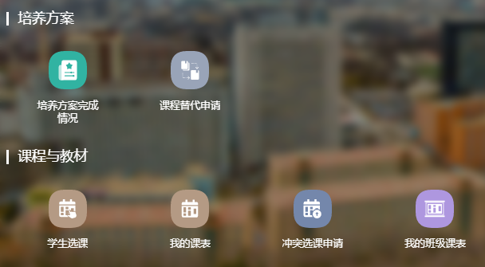
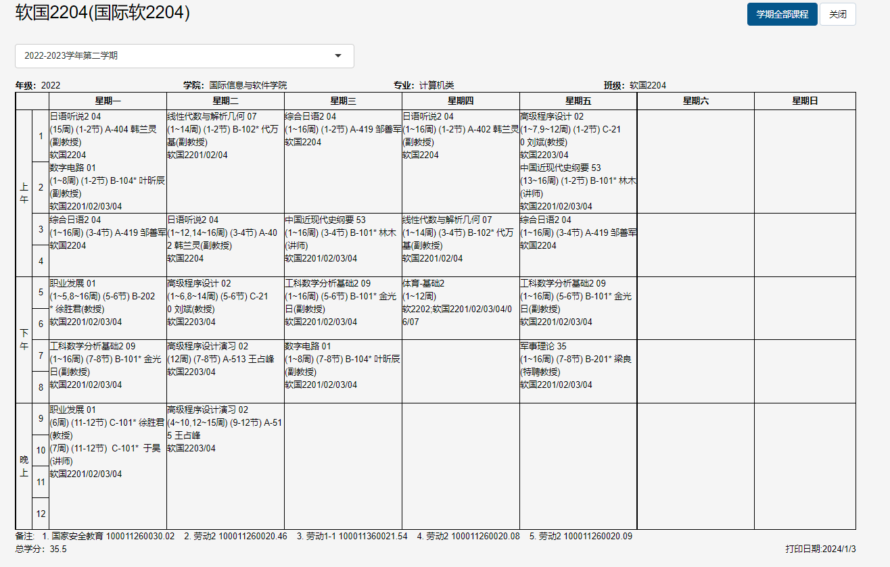
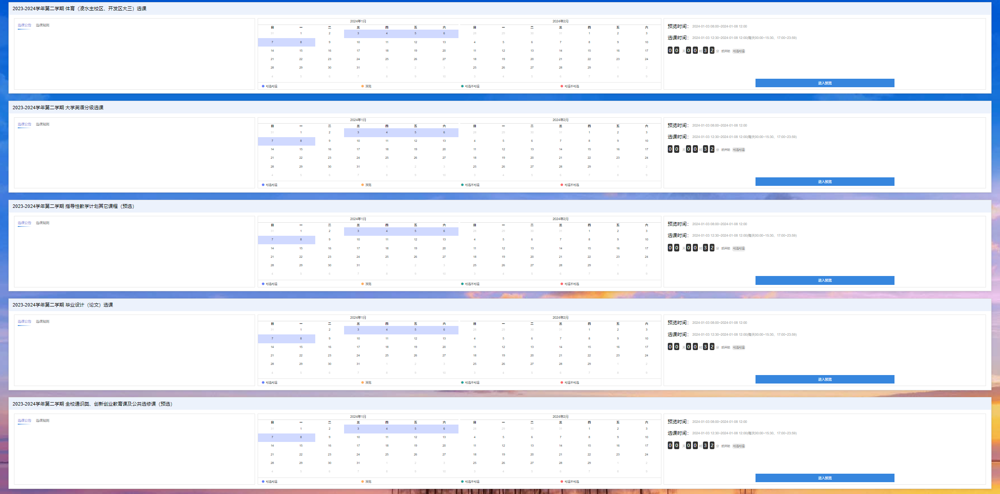
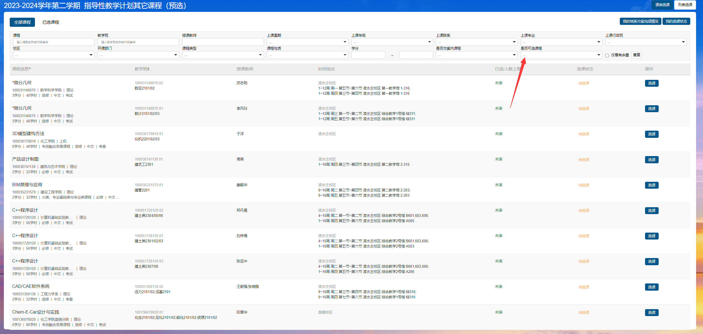

import { Aside } from "@astrojs/starlight/components";

特别鸣谢：[AzeniaX](https://github.com/AzeniaX)

## 如何进入选课系统

大连理工大学学生综合教学管理系统：[http://jxgl.dlut.edu.cn/student/home](http://jxgl.dlut.edu.cn/student/home)

登录系统后下拉，这些是我们选课阶段会用到的：

点击 **学生选课**，即可进入选课系统。

## 选课阶段

### 选课预览

在每年选课期的最初一到两天，选课系统提前开放。此时可以提前预览本学期开设的课程。

### 预选

在选课期的最初一周左右时间是预选阶段。在该阶段内，所有课程不限人数，选课不分时间先后，不含重修复修选课。

> **注意**：预选阶段**只可以查看其他年级开设的课程，但不能进行选课操作**，这是正常行为。如果在预选阶段看到某些课程（如大三小学期课程）并未开放选课入口，可能是因为该课程的课堂容量已被提前占满（有同学反映部分老师仅带 8 人），此时无需焦虑，等到正选阶段开放余量后再行选择即可。

每人会被分配 **100 意愿值**，可自由分配。预选阶段结束后，结合预选课程情况，系统将对报名人数大于课堂容量的课程进行自动抽签，此时意愿值越高，被抽中的概率越大（只是提高权重，意愿值 100 也有可能选不上，意愿值 0 也有可能选上）。届时将有部分学生被退出课堂。预选的课程情况并不是最终的选课结果，务必请在正选阶段核实自己的选课结果。

### 正选

在预选阶段结束后将会开启正选阶段。正选阶段时期可以查看自己预选阶段后成功选上和未被抽上的课程，并确认自己的选课情况。除此之外，在本阶段有课余量的课程可以继续选择。正选阶段所有课程限定容量，按照先选先得的原则进行。为避免课程买卖等行为，学校系统会将退课等释放的课程容量于每天中午 12:00 定时释放。

> **注意**：选课期间，每天 **15:30–16:30**，教学运行保障中心将对选课数据进行处理，此期间选课工作暂停。请勿在此时间段内进行选课操作。

### 补退选

在新学期开学前的一周到教学周的前两周是补退选阶段。在该时间段内可以进行重修/复修选课、国内外交流等学籍异动学生选课及本研衔接选修课程选课、本科生选研究生课程。在补退选阶段，因为转专业、重修等原因导致课程冲突的学生可以进行冲突选课申请。除此之外，如果不想上的课程也可以在此阶段随时退课。在此阶段，部分课程视情况会增加一定课容量，可根据自己的实际情况进行补退选。

## 预选阶段攻略

在预选阶段所有课程不限人数，选课不分时间先后，因此不需要着急，在预选的几天内合理安排时间选课即可。

预选阶段进行的是必修和公共选修课的选择。开发区校区的体育课在正选阶段进行抢课，预选阶段的体育课只是随机分配的占坑课程，在预选阶段结束后自动退掉，无需在意。

### 班级课表

首先，我们要认识班级课表，在教务系统找到“我的班级课表”，点击进入即可看到以行政班为单位安排的班级课表。

这张课表是教务预先安排好的，包含了全部的本学期建议修读的必修课，并且已经分配好了教学班和老师。因此，对于必修课程，我们只需要对照班级课表上面的课程依次选择即可。

### 选课系统

点开选课系统，我们可以看到有很多项，它们分别对应了不同的课程。

- **凌水校区和开发区校区大三的体育选课**，大一大二可以无视。
- **大学英语分级选课**，根据你入学英语考试的分级情况进行后续的大英选课。
- **指导性教学计划其它课程（预选）**，我们的必修课在这里选择。
- **毕业设计(论文)选课**，大一大二可以无视。
- **全校通识类、创新创业教育课及公共选修课**，我们的通识课和选修课在这里选择。

点击其中一项进入之后，会看到这样的界面。上面的各项索引请妥善使用，能帮助你更快找到课程。

如果看不到课程，记得检查“是否可选课程”这一项，将其改为可选即可。使用列表选课选择结束后，可以点击右上角的课表选课，检查自己所选课程的排列情况。

注意：在哪一项里面选择的课程就要在哪一项里面取消。如果无法退课，查看自己这门课是不是在这个项目里面选择的。例如，在指导性教学计划其它课程里面选择的课程，在其他选课项目里面是无法退课的，此时只需要回到指导性教学计划那一项里面就可以正常退课了。

### 意愿值

在预选阶段，每个人会被分配到 **100 意愿值**。预选结束后会启动抽签机制：你选这门课用 n 个意愿值，相当于在这门课的桶里投了 n+1 个签，系统会对所有签进行随机遍历。如果某个签对应的同学没选上这门课，则将其加入成功选课列表；如果该同学已选上课，则 continue 进行下一轮遍历，直到成功选课列表的 size 与总人数相等。也就是说，用的意愿值越多，选上课的概率越大，但即使给 100 个意愿值，概率也不会等于 100%；用的意愿值越少，选上课的概率越小，但即使给 0 个意愿值，概率也不会等于 0%。另外，如果课程没被选满，那么给 0 个意愿值也能选上课。

对于班级课表里面的必修课来说，意愿值分配 **0** 即可，如果实在担心掉课，可以分配 **1-5 意愿值**。意愿值主要用在选修课和劳动课等的抽选，由于开发区劳动 2 课程容量极其有限，美育课一般只有音乐鉴赏一个选项，因此抢这门课程很多时候 100 意愿值也难选上。无数学长从大一掉课掉到大三。因此，请珍惜你选上的选修课和意愿值。

### 选课思路

首先，我们要知道预选阶段的两个前提：

1. 预选阶段不可以有时间冲突的课程。
2. 预选阶段部分学院和课程规定不能跨教学班选课。

并且预选阶段选课不分先后，因此主要是策略问题。

#### 必修课

对于必修课，我们直接先按照班级课表选课，并且意愿值给 **0** 即可。如果认为你班级课表里分配的老师可能有争议，如果你所在学院可以跨教学班选课，那么可以直接选择同时间的另一个教学班老师的同名课程，并分配一定的意愿值。如果你的课程不能在预选阶段跨教学班选课，那么预选可以不用选他，等正选的时候直接选其他老师的课（因为要避免时间冲突，你预选选上了，正选的时候要先退课才能选，会慢人一步）。

#### 通识/选修课

对于选修课，我们要知道的是，多数学院本科生培养方案规定：

- 必须从全校通识课列表中修读
- 劳动 2 课程
- 《国家安全教育》课程
- 一门创新创业课程
- 一门“四史类”课程
- 一门“美育类”课程
- 《经济学原理》及《现代工程导论》两门课中选修一门。

这六门课程在毕业之前需要修读完毕。而开发区校区除国家安全教育作为网络通识课之外，其他几类课程的开课容量和时间都极其有限。因此建议从大一开始就选择这些课程，以免后期选不上或者必修课时间覆盖掉这些课程，最终导致差几学分没法正常大四实习或毕业，得不偿失。（如果实在课程太多，不建议都选上，上这些课也是比较麻烦，觉得太累补退选阶段及时退课。）

此时，就寻找你必修课选择后剩余的空位，把这几门课程都选上，意愿值直接梭哈。

关于 **四史类** 课程，据同学反馈该课程**期期撞课**（与必修课冲突概率高），选课前务必留意培养方案中对该课程的学期要求，提前做好规划。有同学反映张瑊老师的四史课程体验较为轻松。

关于 **美育类** 课程，常见选项包括**音乐鉴赏**。《数据时代的艺术表达》属于**综合素质类**课程，不在美育类模块内。该课程**无期末考试**，但考勤为老师随机点名（通过发纸写题目的方式进行），且结课有大作业（如手绘邮票设计，用纸笔手绘完成，非电脑作图）。

《经济学原理》在开发区校区部分学期可能不开放选课，主校区和盘锦校区通常可选。若培养方案要求在《经济学原理》和《现代工程导论》中二选一，选课前请先确认本校区是否有开课。

#### 必修课时间冲突怎么处理

如果你在选课时发现两门课程都像是“必修”，但系统提示存在时间冲突，不要急着盲选，先做这三步：

1. 回到培养计划里确认两门课是否都属于当前学期必须完成的课程。
2. 在选课系统里查看课程名称后的开课时间，判断这门课是不是后续学期还会继续开设。
3. 再结合班级课表确认冲突是不是教务排课导致的同一时段冲突。

一般来说，如果其中一门课在后续多个学期还会继续开，而另一门课只在某个固定学期开放，那么优先保留开课窗口更窄的那门课。例如群里同学反馈过“程序”和“创新”冲突的情况，判断依据就是程序课只在大一小学期开设，而创新课程后续学期还会继续开。这种情况下，优先保证当前学期不容易补修的课程，另一门放到后续学期更稳妥。

如果两门课都不确定是否能后续补选，或者都显示为当前培养计划中的关键课程，建议尽快咨询辅导员、教学秘书或对应课程老师，不要仅凭意愿值和抢课结果硬赌。

#### 注意事项

1. **《国家安全教育》课程**建议直接在课比较少时间充裕的大一下学期选课，作为网络通识课容量无限且不占据正课时间，下个学期考试前将网络平台上的视频看完并按时在电脑上参加考试即可。（请一定别忘记刷课和参加考试，没有补考，挂科很麻烦。）
2. 软国有意向参加“2+2”赴日学习的同学，在赴日前必须完成“国家安全教育”课程的修读。

3. 网络通识课均为通识类扩展课程，有“尔雅通识教育网络课”（课程代码以“y”结尾）和“东西部联盟通识教育网络课”（课程代码以“z”结尾）。该类课程均为网络授课，不安排具体时间地点。请选择此类课程的同学认真检查选课结果，并在规定的学习平台进行注册、学习及考核，一定别忘了自己选了这门课。
4. **小学期课程冲突**：部分同学反映创业、四史与小学期必修实践课存在冲突。可参考往届经验，在同一时间段的实践课中选择其他教学班来避开冲突。若只能通过代课解决，请提前确认可行性，部分课程（如人数较少的小班教学）代课风险较高。
5. **创新创业课程**：两门创新创业课程均需修读。签到通常以问卷二维码形式进行。部分班级最终以小组大作业形式评定成绩（如付冬娟老师班级）。
6. **四史课程**：有同学推荐”社会主义发展史”，为开卷考试，不缺勤的情况下分数通常较友好。中共党史（2026 年数据）也为机考开卷形式，占比 50%，可带教材和打印材料，题型较固定，建议找老师要复习 PPT 直接背诵。

## 免听申请

<Aside>
  一般只有转专业和重修的同学才会审核通过。如果是第一次选课，请提前和授课老师和教务老师沟通清楚。
</Aside>

在补退选阶段进入冲突选课申请模块，选择要申请的课程，填写申请理由，提交申请。等待审核通过后，即可免听该门课程。

申请免听前请先和授课老师联系，确定好后再进行申请。以免老师忘记审核或者被拒绝。一学期最多可以申请 4 次免听，被拒绝的申请也计算在内。

一般来说免听的同学没有平时分，期末考试卷面成绩计算即为终成绩。但是也有部分课程，如微积分等，做了作业也会给一定的平时分。具体情况请和授课老师沟通，可以向对应班上的同学索要课程群，以免漏掉信息。
