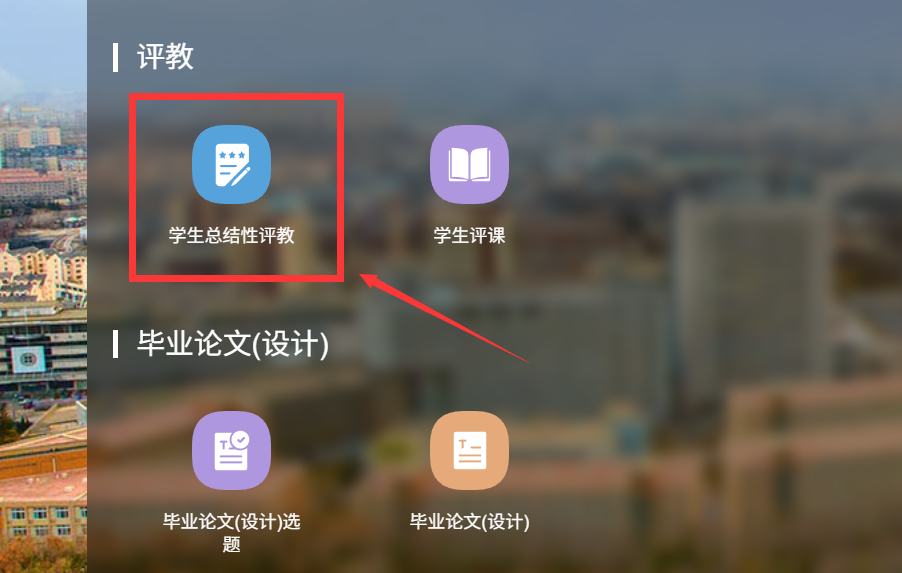
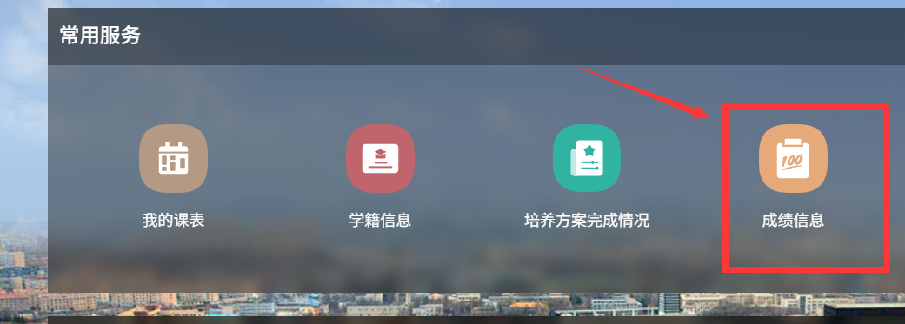

一般大学期间的大型考试包括英语四六级、各种证书的认证（如 CCF CSP 认证），以及最重要的每门课程的期末考试等。这里我们重点说学校的考试。

#### 有形的大手

大连理工大学考试纪律：

> 1. 应持学生证、学生卡（含有效证件）提前入场，按座号入座，把证件放在考桌右前方，非应试学生不得入场。
> 2. 不准携带手机等通讯设备进入考场，否则按违纪处理。
> 3. 机考时，不允许打开与考试无关的窗口和内容。
> 4. 开考20分钟后，不准入场，该门课程作为旷考处理按时参加（注意缺考旷考0分是没有补考资格的，需要再次开课时重修该门课程）；未经允许中途不得离开考场，一经离开考场（如去厕所），就不能继续答卷；交卷后应立即离开考场。
> 5. 考试时，除规定的考试用具外，其它用具一律禁止带入座位，应集中存放在教室前面、讲台周围，准许使用的用具不准互借，不准垫纸、垫本，必要时可用垫板。不准交头接耳、左顾右盼、讲话、看书、抄袭、代考，不准挟带、垫与考核课程有关的材料等，上述情况均属舞弊行为。对舞弊者及提供条件给别人作弊者，该门课程以零分计，并给予纪律处分，记入档案。
> 6. 考题如有字迹不清之处，可举手向主考教师提出，但不得提出解释题意等要求。
> 7. 考试结束前5分钟不得交卷，交卷时应将考卷有文字的一面朝内折叠好放在桌面上，待监考教师收取后，方可离开考场。
> 8. 考试结束后，必须交卷。到时不交卷者，监考人员有权根据情况进行处理。不得将考卷带出考场，擅自带出考场者，其考卷作废并视其情节轻重给予纪律处分。

详细的惩罚措施可参考大学生手册。目前没听说过有因考试作弊吃铁拳的先例，但是大家不要以身试法。

#### 成绩查询

学校考试考完后一般一周左右发布成绩，也有可能会早或晚，时间不固定。成绩公布后学生可在教务系统查到分数，但需要先进行该课程的教师评教才能看到分数：

懒得评教怎么办？欢迎使用懒人脚本：[DUT_TeacherEvaluation_Auto_Submit_Tool: 实现 大连理工大学教务系统学生总结性评教问卷 的 自动填写及提交 的 脚本](https://github.com/Lentinel/DUT_TeacherEvaluation_Auto_Submit_Tool)

#### 补缓考

正考分数在 60 以下即为挂科，大部分课程需要参加补考，少部分无补考只能重修（如各选修课）。也有课程无考试，而是通过其他形式（如大作业等）给出期末成绩，也算是正考成绩。正考挂科超过两次即失去保研资格（包括体育课），不过选修课挂科无影响。补考一般安排在下学期开学后第一周的周末，补考仅有卷面成绩，无平时成绩（即考多少算多少，卷面成绩按 100% 计算到最终成绩）。若补考再挂科则只能重修。补考/重修通过后，计算 GPA 时该课程无视实际分数按 60 分算。

若正考时出现特殊情况（如生病等）无法参加考试，可在教务系统提交相关佐证材料申请缓考。缓考的时间和试题与补考相同，且缓考也没有平时成绩，但是成绩与正考同效力，GPA 正常计算，也不影响保研等。若缓考挂科就只能重修该课程，没有补考，所以申请缓考要谨慎。

#### 期末周与放假时间

由于各课程结课时间不同，大连理工大学没有统一的“考试周”，期末考试时间一般安排在该课程结课后的两周后左右。不过每学期末各学院一般会允许本科生申请通宵供电以进行复习。无特殊情况时，考完本学期最后一门后就可以立马离校进入假期，无视校历。
