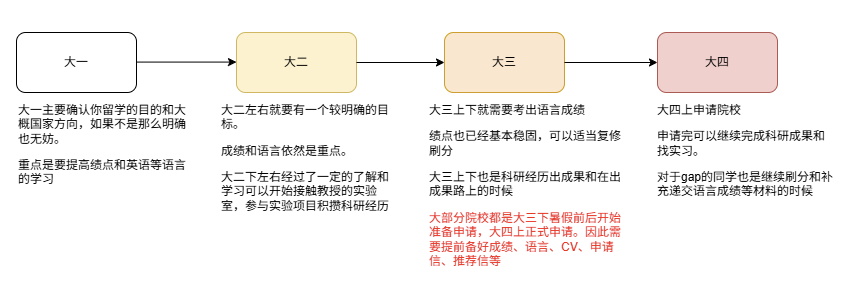

本留学指南为18级校友张恒源（留学仙人）编写，意在帮助大连理工大学的同学们了解留学，熟悉申请，帮助同学们更好地实现自己的留学梦。同时本指南属于一个基础的介绍讲解，如需要更多留学资料和帮助欢迎加入**大工留学QQ群：776310648** 群内有大量优秀校友为大家解答留学问题，也会不定期开展留学讲座。

**非常建议所有同学都阅读完本指南第一章**，无论是已有留学需求还是单纯想拓宽视野，只有在对留学有了一定了解之后才知道自己是否可以或者是否适合留学，从而多一条道路选择，**选择大于努力。**

本指南受到大连理工大学NAOSI网络与开源协会邀请发布在大工生存手册中的飞跃手册出国留学板块，且将持续更新。

希望本指南能够更好的帮助到想要留学的学弟学妹们，帮助大家了解留学，减少信息差，申请不踩坑。愿大家都能取得心仪的梦校Offer！

—— 张恒源

## 第一章 留学介绍科普

### 1.1 为什么选择出国留学？

随着国家发展和全球化加深，中国每年赴海外留学的人数日益增多，加之未来国内企业不可避免的走向世界，留学正逐渐成为一个可选项而不再是过去遥不可及的想法。

同时，保研压力巨大，保外名校困难，以及每年考研人数都在增加，这类由人数产生的无效内卷会导致你无法保研/考研到与你能力相匹配的学校。另外国内保研扩招，考研和专硕的花费问题以及读研三年的时间成本，也需要大家考虑清楚，理性选择，**选择大于努力**。

这里要补充一句，留学和保研是并列关系，而不是保研失败才考虑留学，大工往年有非常多的优秀校友选择弃保出国，因为保研的水平可以在外申请比本校更好的国际院校。

另外，国内的学术氛围科研环境和就业压力工作待遇等多方面因素也让越来越多的人将目光放到了海外赛道中。建议大家保研和读博之前，先了解下国内研究生和博士的就读现状。

对于出国留学，每个人的目的不同，主要分为“留”和“学”或者两者皆有：移民、学术深造、镀金、拓宽视野、接触其他阶层的人等。因此，在考虑到留学这一选项时，你的目的就尤为重要，建议将目光放长远，做短期几年的规划，根据你的目的来选择你的答案：我为什么选择出国留学？

### 1.2 留学申请项目介绍

一般来说各国的申请项目分为如下几个类别，可能有些许差异但大体类似。

#### Msc/Meng（授课型硕士）

是申请国外研究生最多也最主要的类别，以工作就业为导向，时长一般为一年，修完要求课程为毕业要求。一些带短期的实习（coop）时长为一年半左右，一般作为向研究型硕士过渡的方法和获取工作签证的主要方式。但这种一年制的授课项目无法帮助你申请博士，且由于国内直接申请研究硕/博士项目难度极大，常见读博的方法是先读授课硕，然后在读期间联系导师，或者继续做1-2年Ra，最后转博士。

**这里不推荐没有科研想法和能力的同学硬要申请研究硕和读博，授课硕就满足就业需求了，不适合科研却硬上，只会徒增痛苦，而且也不好申请上。**

#### Mphil（研究型硕士）

时长一般两年，以研究为主，在毕业上有科研要求。这类硕士是作为博士预科来进行科研活动，一般要求申请人有较高的科研经历和能力，**申请难度较大。不建议科研产出和经历较弱的同学申请**。

#### PhD（博士）

在海外留学中，一般是年龄和学历越高越难申请，理工类的PhD含金量极高，**申请难度最大。对申请人的学术能力和Connection要求也最高。**绝大多数PhD都提供奖学金（英国自费读博较多），基本可覆盖读书期间的生活开销，但**请大家不要抱着“读博不怎么花钱所以我要申请博士”的想法来尝试申请，要对自己的实力和申请的难度有一定认知。**

PhD申请难度极大，没有足够强的科研成果（如顶区一作）和Connection完全不推荐申请，请大家不要心比天高命比纸薄。

#### Ra（科研助手）

一般是作为硕士到博士的一个过度阶段，而非正常学位，是让教授认识你，了解你科研能力进而决定是否招你做博士的一个过程。有少量薪资或者纯自费，意义是为转博士做铺垫。

#### CSC（国家公费派遣）

由国家提供资金赴外读博或交换的项目，一般以博士项目为主，需要自己申请。特别注意的是这类项目一般都要求回国工作一定年份，**请大家在享受福利的同时也要尽到相应的义务，不要做过河拆桥和断后来人路的事情。**

总之，无论什么项目，什么院校，**都需要大家对自身实力和项目申请难度有一个较为清晰的认知，不要“心比天高 命比纸薄”，**否者极容易陷入中介的虚假承诺陷阱或是申请失利全拒德。

### 1.3 留学问题扫盲

#### 我能 / 适合留学么？

很多同学都会觉得留学对自己很遥远，完全不考虑，或者认为留学是有钱人家孩子才会选的，因此在一开始就不考虑留学，但比如日本留学的花销并不多，跟专硕比起来甚至差别不大。而且如csc等项目受国家资助的一样可以出国，对家庭压力较小。因此希望大家了解了清楚留学之后再做选择，不要早早的断自己一条路，选择大于努力。

#### 是不是只有成绩不好的才留学？

非也，大工每年有非常多的学长学姐选择弃保出国，因为以保研的成绩水平能去留学的院校会比保研能去的院校好太多太多了。更别提是保本校的情况下，那选择出国的就更多了。同时对于大工同学来说，因为下限已经985了，就不建议出去读太野鸡的学校，而国外好的大学对成绩要求都很高，因此如果想要留学的，和保研一样一开始就好好好保证成绩。

（每年考研出成绩之后就会有很多同学才想起出国，但如果这时候才发现出国一样需要好绩点还费钱，而自己的成绩非常一般，就是真的完蛋了。）

#### 国外是不是都是水硕？认可度怎么样？

首先要明确一个事情，国内的硕士水分就少么？三年的硕就有含金量么？世界上只有一个地方的研究生需要读三年。（好难猜是哪里啊）

其次水不水要看你的专业和院校，如果谁觉得MIT和哈佛的理工类水，或者觉得德国的理工类PhD水没有含金量，那只能尊重且祝福。

认可度上基本没问题，因为大家已经是985的本科了，起点够高，读硕士只会更上一层楼，不用担心和国内硕比认可度不够，你留学过程中培养的能力，开阔的眼界和节省下的时间才是最宝贵的财富。

#### Qs排名等国际排名是不是就代表这个学校很好？

目前常见的国际排名如Qs，大家看个乐就行别当真，排名基本靠学校氪金冲榜（如澳洲）。经典笑话如：谁会拒绝排名56的马来西亚大学而去58的纽约大学呢（Qs 2026）？或 你可以申请世界第二的IC，但不能用排名第三的斯坦福和第五的哈佛来保底（Qs 2026）。

**如果谁用Qs排名来嘲笑你的学校的话，那这个人肯定一点不懂留学。**

#### 该如何收集信息？很多平台的信息看得我非常焦虑怎么办？

随着互联网上的无效内容日渐增加，还是希望大家能够明辨真假，多和学长学姐讨论请教（要有礼貌，有礼貌，有礼貌），也可以在一亩三分地和opencs上查阅有关资料，但是要记得对比确认，比如同样的绩点和语言，就要确认好是不是其他申请背景也差不多，其实留学申请都是千人千面的，每一个申请都具有不可复制性，最忌讳“别人行 我也行”，比如申请博士，也许去年教授需要这个方向的人，招了一个，招满了，今年不需要这个方向的了，你还看去年的申请经验一样申请，结果就不一样了。

这里额外提一嘴在申请时要少看小红书的案例和信息，小红书很多帖子是软广和胡编瞎写的，目的多种多样，你无法辨别发帖人的真实信息，因此不要全盘相信，看多了只会自我焦虑，影响正常的自我定位和申请，可以加入留学群（QQ776310648）多和学长学姐们沟通。

#### 申请 DIY or 中介？

靠谱的中介 > DIY >> 不靠谱的中介

- 对申请来说，市面常见的连锁机构中介是不如同学自己研究进行DIY申请的，因此推荐有实力有目标有时间的同学DIY申请。尤其市面的大部分中介文书员工的文凭可能仅限于一二本的社科文科（没有说文科不好的意思），甚至有的都没有出过国，这类中介帮大工这个985层次的同学来申请属实是外行指导内行。不如进留学群请教自己认识的学长学姐们靠谱。而且一般市面的中介无法提供有价值的选校服务，都是给你一个大Excel表让你自己选几个，只能作为单纯的文书和邮件收发业务的agent。对于申请研究硕和博士的同学尤其建议自己申请或者找到靠谱的中介。（大工有个校友工作室，下文介绍）
- 同时，**对于找中介的同学，也绝对不要当甩手掌柜，不要觉得交了钱就全让中介来干就好了**。如果不是靠谱的中介，那么轻则被坑，申请失利去不到应得的学校，重则机构卷钱跑路/倒闭（写本指南时恰逢黑店百利天下倒闭）。一定多跟机构沟通协商，机构写的文书和发的邮件要自己看一遍。

如何来判断一个中介是否靠谱呢？

- 看和你同校/层次的学生的详细录取情况，一般要看学生专业，去向专业，绩点和除绩点外的申请背景，单纯只看绩点和语言没有参考价值（比如人家比你多强推/论文/实习）。（**很多中介喜欢用虚假虚构的案例来欺骗学生，因此案例大家不要看了就信，尤其海报上宣传的什么 abcd同学录取哪里，建议大家擦亮眼睛**）
- 中介负责的内容：文书、签证、申请、选校等（**很多中介喜欢推荐实习和科研等额外费用，这种完全没用，都是坑人骗钱的。**）。以及由谁来负责申请，申请负责人是什么学历水平背景。
- 价格，建议大家货比三家，比价格比服务，不盲目信任大品牌，也不要只图便宜不看服务。
- 看是否着急要你签约，和用“保底”来忽悠你？一般不建议大家太早报中介，大二下到大三下这个时间比较好，太早签约中介除了被套牢没有任何作用。

> 而所谓的“保底”，在留学申请中不存在任何“保底”一说，只要和你这么说的就是忽悠你，用一堆不切合申请人实际能力但申请人爱听的“高大上院校”来麻痹申请人和家长，实则用非常垃圾的院校专业作为保底，最后申请人大概率只能去这类垃圾“保底”学校。

**靠谱中介**：对于需要帮助，自己无法完成文书、希望花钱买时间、需要内行指导的选校规划、需要科研规划、博士申请面试指导的同学来说，一个靠谱的中介就是你所需要的。

> **目前本指南只推荐大工校友工作室——留学昇（不是广告不是广告不是广告）**
>
> 成员大部分为大工校友，当大家了解过市面上鱼龙混杂的无良机构和黑心中介的种种套路和坑之后才知道由学长学姐指导学弟学妹申请更放心，更专业。
>
> 联系方式：13654151598 （二维码放在本小节最后）
>
> **该校友工作室成员均为985理工类学生，大部成员为大工校友，且均就读于海外名校硕博项目，工作室几乎全员博士。**
>
> 工作室成立目的便是为了帮助学弟学妹不被市面良莠不齐鱼龙混杂的机构坑害，损失金钱和未来；更好的指导学弟学妹申请留学，更专业的帮助大家选择适合未来发展的院校、专业、教授。也能指导博士和研究硕的申请。
>
> 
>
> 大工校友工作室留学昇二维码

## 第二章 国家和地区简介

### 2.1 美国

时至今日美国也是在学术界含金量最高的地区（也最贵），是大量的世界名校所在地，非常推荐读博和计算机相关专业的同学申请。后期移民则可以考虑走NIW和EB1A。

同时美国对申请学生的要求也高，对于授课硕，建议大家在成绩、语言、gre、科研各方面都不差的前提下至少有一项非常突出。

费用方面：年花费50-70w左右，上不封顶。

### 2.2 加拿大

加拿大在科研学术界可谓是扫地僧一般的存在，科研实力雄厚，且拥有多位祖师爷级人物都来自加拿大，整体教学质量很高，素有“研究在加拿大，应用在美国”的情况。但加拿大院校一般排名较低，回国发展可能在知名度和排名方面吃亏。

移民政策也更友好，华人移民较多，生活饮食方面有T&T等华人超市，更符合国人饮食习惯，生活节奏慢，最适合work life balance。（但写此文的时候加拿大收紧移民政策且印度人较多）

费用方面：年花费30-40w

### 2.3 英国

英国的Qs排名很高，以一年授课硕士为主，适合快进快出的文凭需求，也可以在读书期间游玩欧洲，移民基本不太可能。博士申请方面，英国全奖博士一般不提供给国外留学生，多数是要求自费读博。（不推荐，读不起的）

莱斯特的同学由于拥有英本毕业证，申请英系国家有更大的优势，去向较好。

费用方面：年花费50-60w

### 2.4 中国香港

随着近年国内读研的压力、美国政策变化、香港建设内地校区等种种原因，越来越多的同学选择香港留学。香港留学的认可度很高，港三院校在多个排名均名列前茅，教学质量高，还可以在深圳居住通勤和实习，另外有港科广，港中文等多个内地校区。

对于工作为导向的同学，很推荐香港就读。港科广和港中文竞争难度较大，推荐大家关注红鸟计划，每年会在学校宣传。

同时建议大家申请时以专业排名为导向，不要只看学校整体排名，比如计算机专业下港大就不如其他两所学校。

在申请难度方面，以大工CS同学为例：均分85，雅思6.5 在港三新二就能有书读。

（中国澳门情况与香港类似，但申请难度和花费较香港小一些）

费用方面：年花费40-50w

### 2.5 新加坡

和前文中国香港类似的情况，大家在申请时会港三新二一起申请，NUS和NTU的排名也高，NUS的国际学术能力更强，港新整体非常热门，也可以作为PhD的跳板。

对于读博的同学建议在申请的时候确认好导师组内中国人的数量，避免新加坡政策限制无法录取。

在申请难度方面，以大工CS同学为例：均分85，雅思6.5 在港三新二就能有书读。

费用方面：年花费30-40w

### 2.6 日本

性价比最高的留学地区，整体花费较少，一般以两年硕士为主，主要申请方式有：预科研究生，修士直考，SGU英文项目。对读研和读博的毕业要求较友好。

预科需要和英语系国家一样先申请，进入学校学习半年或一年后参加修士考试，成功上岸即成为修士，需要日语考试JLPT的成绩要求，也需要提前与教授套磁。预科的优势是提前接触教授和实验室，能够了解到考试侧重点，针对性学习。

直考是利用旅游签直接参加日本的修士考试（类似国内研究生考试），但日本修士考试各个学校开考时间不一样，旅游签无法覆盖全部，推荐走预科使用学签来准备考试。

预科和直考都需要参加修士考试，一年两次，分夏考（名额多）和冬考，类似国内考研，按大工同学考研的努力程度，考入旧帝国大学范围的院校是常见情况。推荐有日语基础的同学或者有考研打算的同学走这个路线。

SGU则是英文项目，免笔试，对个人能力和英语能力要求较高，名额较少，推荐大佬申请。

这里需要强调一个大工同学常见问题：不要抱着“我堂堂大工985的学生，屈尊到日本来读书，非东京大学或京都大学我不去的想法”。大工每个院一年去日本top院校的同学，如果有，也只有个位数。

费用方面：多数地区两年总花费不超过20w，大城市或一些IPS项目费用25w±

### 2.7 欧洲

欧洲国家较多，主流国家如德国、瑞士、瑞典等，上下限较大，如德国理工类PhD的含金量（德国读研的三年是我五年中最快乐的七年）和意大利硕士。

欧洲一些国家对学费给予减免，但对申请人有课程适配度的要求，在申请专业时要查看自己是否缺少要求的专业课程，及时补修好。想申请德国的同学要完成APS审核。

大工有一个瑞典KTH的项目很不错，感兴趣的同学可以关注。

同时部分国家的移民政策也不同，有些比较好留，如德国等，还需要大家多查阅具体的移民政策。

费用方面：9-20w因国家而异

### 2.8 其他地区

澳洲、马来西亚、迪拜等其他地区的留学同学较少，目前不做介绍，感兴趣的同学请自行查阅。

## 第三章 留学准备规划

### 3.1 留学时间线规划

对于想要留学的同学，需要尽早做好规划。对于想要申请研究硕或PhD的同学更是要从大一就开始努力做准备才有希望。

（这里要说一嘴不要信市面中介说的帮你做所谓的规划或者早点签约有好处，市面大部分中介不专业而且前两年也没啥能帮到你的）

1.  **大一**：大一主要任务是，提高绩点，学好英语。大工的高学分专业课基本都集中在大一大二，所以无论是留学还是保研都要好好学习。
2.  **大二**：要考虑好自己准备留学去哪个国家了，进而调整方向，成绩和语言依旧是重点。这个时期也可以接触老师进实验室做项目，积攒科研经历和成果。建议大二下余力的可以出语言成绩了。
3.  **大三**：**申请留学一般用前三年成绩，绩点直接参照出国成绩单英文版。**大三这学年必须要考出语言成绩，也是出科研经历和成果最重要的时候，留学申请一般都是在大四上申请，也就是需要大三下到暑假提前准备好成绩、语言、文书、推荐信等。
4.  **大四**：大四上申请院校，一般冬天到次年春天会出结果，这段时间可以继续完成科研和实习，如果gap的同学也可以继续刷分和补充语言成绩等材料。

### 3.2 申请前背景提升

#### 绩点

目前最有效的绩点计算方式是i大工app自助打印上的出国成绩单英文版本，一切以此为基准（17年以后无法删减课程）。

挂科目前仍然不出现在出国成绩单上，依然可以复修刷分。

#### 刷分

一般建议大家在初学课程的时候就尽力在重要基础和专业课程上取得好的成绩，争取考到90分以上。大一大二的很多课程学分很高，对GPA影响非常大。刷分是作为一个锦上添花的辅助手段，可以在成绩没有别的有效提升办法下选修一些网络通识课程来提高一些GPA。

对于基础课和专业课建议不要复修刷分，争取一次过，取得较好成绩，受时间精力、学业压力等多种因素影响，复修刷分很少能成功。**尤其大一大二不建议复修刷分**，以免捡了芝麻丢了西瓜，影响其他专业课程。复修仅推荐成绩较差，改过自新要努力出国的同学大三大四修完专业课后进行。

#### 语言

各个国家地区对语言成绩和考试的要求不一，目前雅思托福都有认可，**但少部分学校或某类项目只接受雅思/托福单独一类成绩，需要大家提前了解清楚。**

- 英联邦如英国加拿大新加坡等国家偏好雅思也接受托福，PTE等。
- 中国香港偏好雅思。
- 美国偏好托福，大部分也接受雅思。
- 日本偏好托福，也推荐托业，部分接受雅思。且日本需要JLPT日语考试。
- 欧洲看具体国家要求。

语言学习上推荐优先自学，可以在网上使用如 小站托福/小站雅思/雅思哥 等网站自己学习练习，也可以在b站和YouTube上学习。发音和对话练习可以用GPT等大模型对练。如果自学效果不佳，则建议机构小班授课或者专项练习。（大工的同学如果自学来说考雅思6.5是较为容易的情况，所以大家好好学外语。）

（GRE GMAT JLPT 等考试暂不介绍，可加入留学群询问相关问题和查阅资料）

#### 科研 & 竞赛

对于申请留学，跟着教授进实验室干活的科研经历、成果是有作用的，如果想要申请研究硕和博士，那必然要有优秀的科研成果（比如一区一作），对于授课硕一样也有作用。建议大家在大二(大一你啥也不会，老师也不爱要你)了解了学院各个教授和研究方向后，跟感兴趣的教授联系和发邮件来沟通进实验室，优先推荐有海外留学经历和海外Connection的教授。（大家都是成年人，联系导师的时候要懂礼貌我就不多说了）

另外提一嘴，市面中介的所谓花钱可以买的“科研”和“实习”都是没有任何作用的，有些过于离谱的会造成学术不端，学术造假的严重行为，也会成为学术污点。

竞赛方面：很抱歉，目前国内的竞赛（包括大创）在申请留学方面作用不大（外面不认就完蛋），大家请把精力侧重点放在科研和实习上，大创只能作为接触老师，让老师认识你进而进入实验室的一种手段，不能算作科研。

#### 实习

对于港新授课硕现在都卷科研的背景下，实习反而更有竞争力，如果是就业为导向的同学，不一定非要卷科研，可以多实习，能够有一段大厂实习经历对授课硕申请和硕士毕业后工作都有非常大的帮助，建议大家在申请季（大四上）之前有对口专业的实习经历。可以关注春秋招和网上大厂申请实习。

#### 交换

建议大家可以多关注大工国际处发布的一些交换项目，但是要区分交换和旅游性质暑研。一般交换至少为一个学期（三个月），国际类交换是获取海外教授connection的有效手段，如果能参与项目组科研，留下较好印象，获得教授的推荐信/强推即可对申请产生巨大帮助，**Connection is All You Need。**同时交换项目可能带来一些学分转换和认证问题，请大家提前问好教务，保留好相应证据以防教务矢口否认。

而一两周左右的暑研等交换项目则为旅行观光性质，在经济条件富足的情况下酌情参加，对申请帮助不大。

### 3.3 留学申请和材料

#### 文书

每个学校的申请可以在对应的招生官网中找到所需要提交的材料，一般包括CV、SP、PS、PR等，这是导师和学校了解你的主要方式，请大家好好准备（插一句，市面机构的一二本文科社科的文书中介写的简历大家最好自己看下改下，基本写的都不行，不推荐直接用）。另外还需要2-3份的推荐信，请提前联系好教授。

篇幅限制这里不展开具体写作方法，可以加入留学群（群号见序）向学长学姐请教。

#### 套磁 / 面试

一些项目申请需要进行面试/套磁，一般是全英文面试，需要大家提前准备好面试ppt和对导师研究方向有了解。可以参考一亩三分地的往年案例或请教学长学姐或小红书真实案例（注意辨别软广），推荐大家加入留学群询问学长学姐。

#### 成绩单与证明材料

开具成绩单，在读证明、毕业、学位证翻译可在自助打印机（西综、一馆和综一）和档案馆分别申请。WES认证时间花费至少两个月，建议同学们九月申请时就准备好认证流程。

#### 资产证明

学校或申请签证部分则需要提供银行资产证明、流水和定位费（港新）。也需要大家提前准备好visa/master 信用卡。

#### 签证

签证所需材料和流程，包括体检和疫苗，无犯罪证明等。

---

受篇幅限制，本指南目前仅写出基础介绍和说明，意在让大家对留学有基础认识，后续持续更新，如果想获取更多信息，欢迎加入大工留学群QQ: 776310648查阅详细资料和与学长学姐沟通讨论,感谢大家的阅读！
