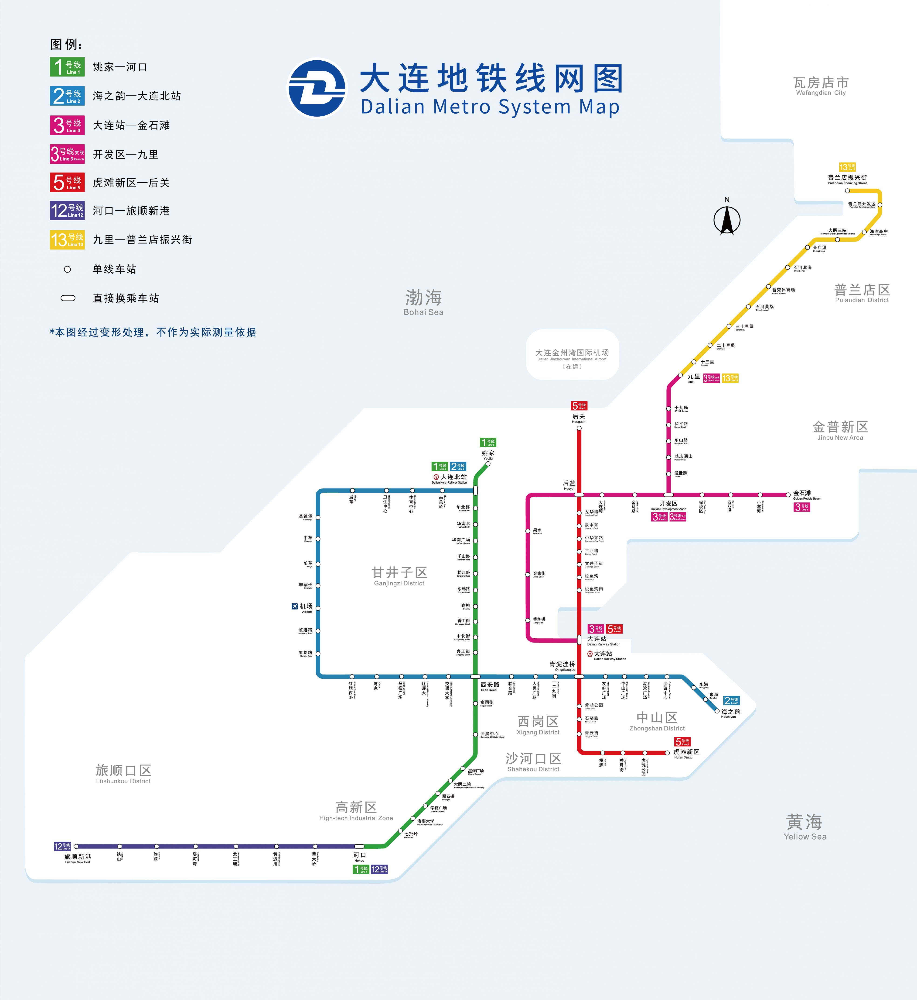
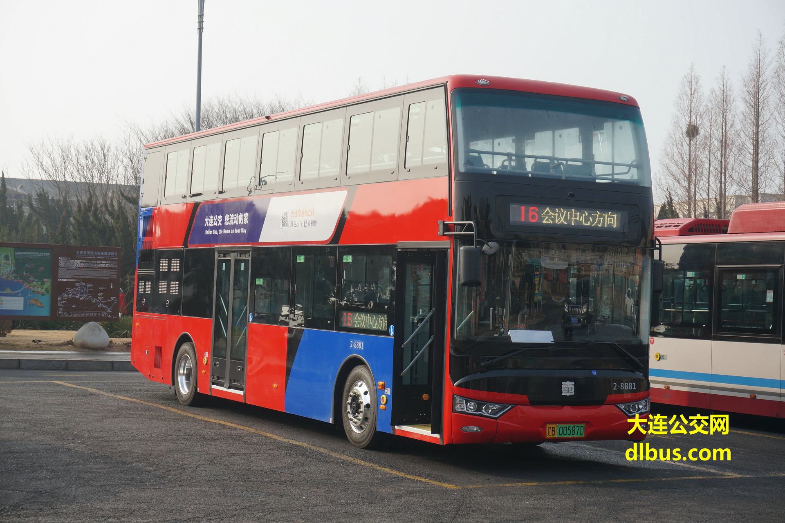
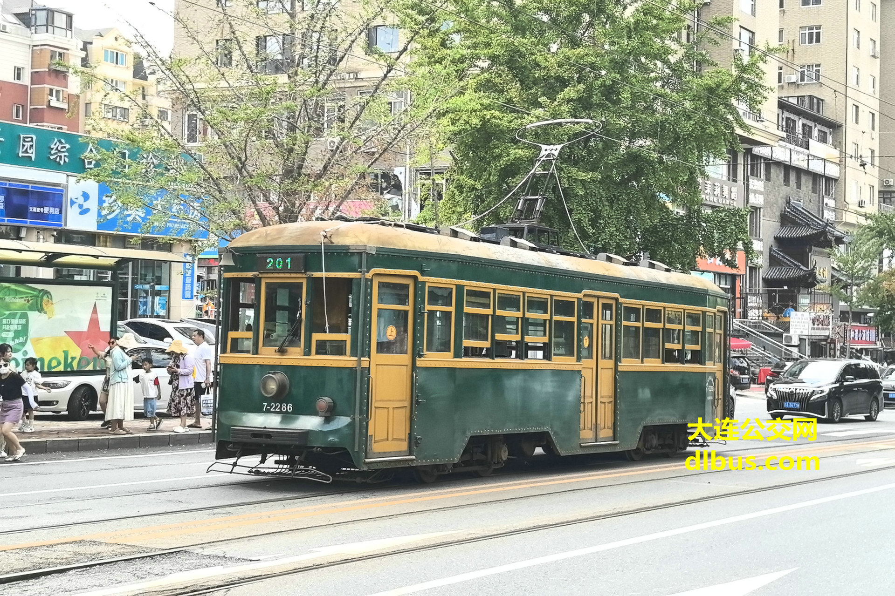
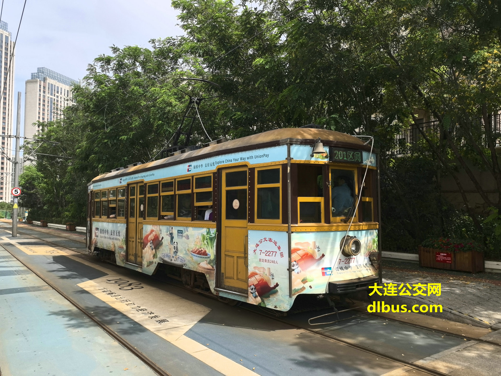
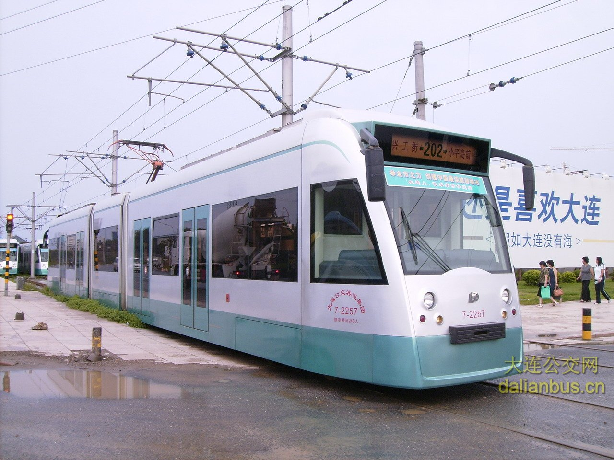

## 一、概述

由于大连市没有共享单车和共享电单车运营，且大部分主干道禁止非机动车通行，公共交通是日常所必需的出行方式之一。另外，大连地铁规划欠合理、线网稀疏，加上凌水校区尚未实现地铁直达等原因，单纯的地铁出行也难以覆盖理工师生的出行需求，因此公交车是必不可少的交通环节。学校周边公交线路较多，和地铁相配合，基本能够满足绝大多数出行需求。

## 二、大连地铁线路总览

大连市目前已有6条地铁线路（1号线、2号线、3号线、5号线、12号线、13号线）和一条在建地铁线路（4号线）。重要交通枢纽（大连站、大连北站、机场）、各大商圈（西安路、青泥洼、华南等）附近均已通地铁。然而从学校出发乘坐地铁并不方便，往往需要步行一段距离，或者乘坐公交车接驳。

### 公交换乘地铁

距离学校西南门最近的地铁站是1号线海事大学站，但是没有直达公交线路，步行需约20分钟。如要乘坐地铁1号线，推荐乘坐10/406路公交车至**学苑广场**站换乘。如需乘坐地铁2号线前往机场方向，若从西南门出发，建议乘坐10路公交车至**大连交通大学**站换乘；若从北门出发，建议乘坐3路公交车至**马栏广场**站换乘。

tips: 
1. 在学苑广场站由公交换乘地铁时，10路车站台比406路站台距离地铁口更近。
2. 在学苑广场站由地铁换乘公交时，从C口乘坐直梯出站，出站即是公交站。

## 三、近校门公交线路一览

### 1. 西南门

西南门门口即是406路和10路公交**理工大学**站。
#### 406路（百合山庄—希望广场）

| 始发站  |  始车  |  末车   | 终点站  |  始车  |  末车   |
| :--: | :--: | :---: | :--: | :--: | :---: |
| 百合山庄 | 5:20 | 22:25 | 希望广场 | 5:00 | 23:00 |

406路公交车是串联起百合山庄、理工大学、黄浦路、中山路沿线和大连市中心的一条重要的公交线路。出凌水路后，406路公交车的走向与地铁1号线大致重合。如果你计划前往黄浦路、中山路沿线地点（如黑石礁、星海公园、大医二院、星海广场等），乘坐406路往往比多换乘一次地铁更方便快捷。

过会展中心后，406路走高尔基路。如果你要前往和平广场、奥林匹克广场、一二九街，以及其他高尔基路沿线地点，那么乘坐406路公交车往往比换乘地铁1号线再换乘2号线更方便快捷。

需要注意406路的终点站是希望广场，下车地点离劳动公园很近，但距离大连火车站、友好广场、中山广场等地还有一段距离。如果需要前往以上地点，或是前往东港片区，请选择其他公交或地铁线路。

406路公交车学苑广场地铁站、黑石礁、大医二院、化物所、会展中心站均可换乘地铁1号线，一二九街站距离地铁2号线一二九街站较近，希望广场站距离地铁青泥洼桥站（2号线、5号线换乘站）较近。

夜间不堵车的情况下，乘坐406路从希望广场站到理工大学站仅需30分钟，明显快于乘地铁多次换乘回校。

406路高峰期会加开百合山庄—会展中心的区间车。
#### 10路（百合山庄—沙河口火车站）

|         始发站          |  始车  |  末车   |         终点站          |  始车  |  末车   |
| :------------------: | :--: | :---: | :------------------: | :--: | :---: |
|         百合山庄         | 5:20 | 20:00 |        沙河口火车站        | 6:00 | 21:00 |
| 每年7月1日-9月30日运营时间 |      | 20:30 | 每年7月1日-9月30日运营时间 |      | 21:30 |

10路车走向比较绕，出凌水路到学苑广场地铁站的这一段线路和406路重合，然后向北开往数码广场方向，途经数码路、五一路、西南路、黄河路、西安路，最终到达终点站沙河口火车站。

10路车的优势在于可以直达东财、软件园、五一路沿线、交大、西安路、兴工街等地点。10路的学苑广场地铁站可以换乘地铁1号线，大连交通大学站可以换乘地铁2号线。如要前往机场方向，在时间充足的情况下，10路换乘地铁2号线的组合是一个不错的选择。

10路高峰期会加开百合山庄—黄河桥的区间车。

### 2. 北门 & 新北门（经管门）

从海山楼和研教楼之间的**北门**出校，左转是901路**理工大学北门**站，右转是26路**燕南街**站。左转直行500米左右是3路**新新广场**站。

新北门出门右转即是901路公交车始发站**大连理工大学**站。
#### 3路（希贤街—马栏广场）

乘坐3路车往马栏广场方向，主要途经红凌路，也可以在终点站马栏广场换乘地铁2号线。

往希贤街方向，3路车填补了学校去往河口方向公交线路的空白。另外，3路是理工大学仅有的两条可以直达高新万达的公交线路之一，但乘3路车去万达并不划算：从北门出发，要从软件园、学苑广场绕一大圈，耗时和步行差不多。
#### 26路（凌水客运站—五一广场）

26路从学校北门出发，沿软件园路、五一路开往西安路、五一广场方向。26路的优势是不绕路，从燕南街站出发，几乎一路沿五一路行驶，是进市中心方向的较近的一条路线。缺点是要去西安路的话，从解放广场站下车，到西安路罗斯福等商场还需要走一小段路。
#### 901路（大连理工大学—中山广场）

901路公交车从学校新北门出发，途经北门、软件园、数码广场、东财、学苑广场（不停车），然后走上黄浦路，之后走向与406路大致相同，最终到达中山广场。

### 3. 西部校区南门（26舍门）

从西部校区南门出来，顺大坡往下走，位于凌水路上的就是406路和10路的**王家村**站。沿高架桥方向往南走一段距离，位于博远路上的就是36路和530路的**王家村**站。
#### 10/406路

如果你的宿舍距离西部校区南门更近，那么步行至王家村站乘车也不失为一种选择，在步行距离差不多的情况下，有座的概率更高。
#### 530路（大有文园—善水街）

530路是为数不多的从学校直达高新万达的公交车，坐到终点站善水街即是。缺点是发车间隔较长，候车时间久。

530路途经七贤岭地铁站，可换乘地铁1号线七贤岭站。如要前往旅顺方向，在该站换乘可以减少绕路。
#### 36路（万科溪之谷—聚贤路）

向南前往高新园区方向；向北途经红凌路、金柳路，可以前往辽师大西山湖校区。

### 4. 东门

刘长春体育馆后身的校门，出校门向北走一小段路，即可看到23路始发站**理工大学东门**站。
#### 23路（理工大学东门—山林街）

从理工大学东门出发，途经数码广场、东财、学苑广场（不停车）随后驶上黄浦路，此后走向与406路大致重合，并继续延伸至友好广场、中山广场，最终到达终点站山林街。

## 四、其他可能用到 or 有特色的公交线路

### 16路（大连海洋大学—会议中心）

大连颇具特色的双层巴士。

### 201路

大连著名的百年有轨电车，自1909年运营至今，车内保留古朴的木质风格。

### 202路（小平岛前—兴工街）

202路有轨电车，属于现代有轨电车，线路走向和地铁1号线大致重合，但笔者认为依然值得体验。

## 五、热点区域公共交通攻略

### 大连火车站

乘坐10/406路公交车至学苑广场地铁站，换乘地铁1号线，在西安路站换乘地铁2号线，至友好广场站下车，D口出站，过马路即是大连火车站南广场。

### 大连北站

乘坐10/406路公交车至学苑广场地铁站，换乘地铁1号线，至大连北站下车，C口出站。出站后是大连北站B1出站层，进站口在左右两侧，乘电梯上楼即可。

### 机场

乘坐3/10路公交车换乘地铁2号线，至机场站下车，A口出站，直行可见国内出发上楼电梯。

### 梭鱼湾观球指南

大连是著名的足球城，足球文化底蕴深厚。中超球队大连英博海发队的主场中升梭鱼湾足球场，拥有良好的观赛视野和观赛氛围，笔者非常推荐实地体验。

中超联赛大多在周末19:35开场，比赛期间梭鱼湾足球场周边地区实行交通管制，赛前请关注官方通知。

地铁5号线梭鱼湾南站距离球场较近，前往球场观赛时，推荐选择公共交通出行，乘坐地铁5号线至梭鱼湾南站下车。球赛散场时，地铁5号线梭鱼湾南站封闭（只出不进），需步行至地铁5号线梭鱼湾站。散场时回校的推荐路线：乘坐地铁5号线至青泥洼桥站，G1口出站，然后沿五惠路步行300米左右，即可到达406路始发站希望广场站。406路希望广场站末班车时间为23:00，请注意时间不要错过末班车。
