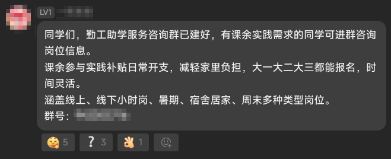
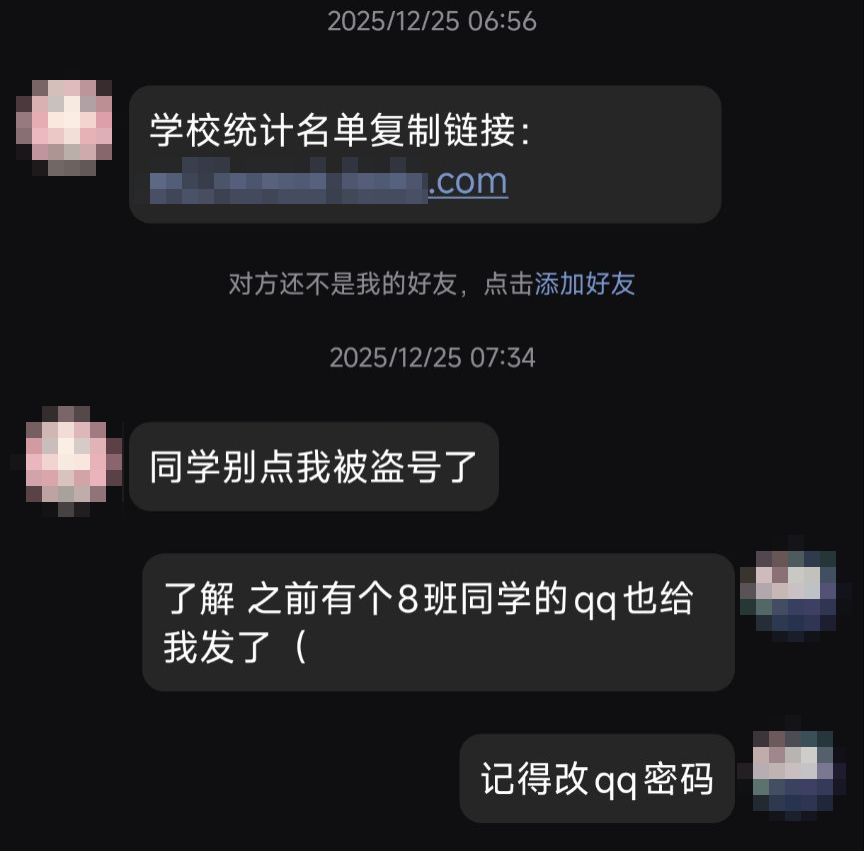
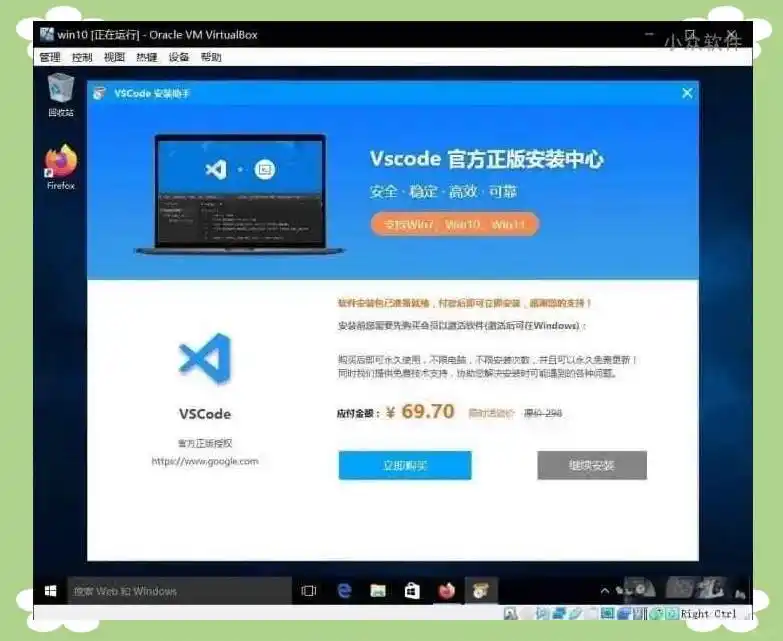
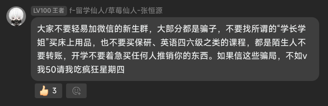

官方媒体的反诈宣传相信大家已经听到耳朵起茧了，但根据笔者的身边统计学调查，依然有很多同学掉入金额不高但迷惑性极强的诈骗陷阱。这是因为，单纯抛出几个名词的高高在上式的反诈宣传，与实际的诈骗情景有很大脱节。笔者希望本文能通过**真实的涉诈情景**，整理出校园内最常见的诈骗手段并提供防范建议，帮助各位同学（不只是新生）保护好自己的钱包和隐私。

## 群消息诈骗

骗子最常出没的地方是各类QQ群，通过QQ的搜索功能，骗子可以很轻松地批量加入各种班级群、年级群、课程群或同学交流群，并批量散布诈骗信息。通常来说，这些信息就是传统的刷单、兼职类诈骗的入口。

下面给出几个真实的QQ群诈骗信息案例（欢迎补充）：

总结这类消息的共同特点：发送者无实名信息，群等级通常只有1级，消息内不提具体学校名“大连理工”，穷尽一切语言只为吸引你进群或与Ta私聊。

防范措施如下：

- 一切通知以辅导员、教务老师、课任老师、班委等官方渠道为准。当然班委也被骗的情况除外。
- 任何大连理工大学的公告一定会有大连理工大学的字样。骗子为了方便广撒网，一般会在消息里去除具体的学校名称。
- 任何要求访问网站、填写信息的操作：
  - 如果是在线文档或问卷，认准老师发布的腾讯文档、金山文档、问卷星等知名平台链接；
  - 如果是网址链接，认准大连理工大学官方域名 `dlut.edu.cn`。
- 加入校内群后尽快按要求把群昵称改为自己的实名信息，方便管理员清除无关人员。

## 盗号诈骗

偶尔会有你的同学（甚至你的好朋友）给你发一些莫名其妙的所谓“通知”“文件”，比如：

这种情况大概率是Ta的QQ号被盗了。当然不排除真的有人相信而批量转发给各个好友和群。

此类消息的识别方法见上一节。防范措施如下：

- 收到此类消息时，如果条件允许，线下与对方面对面确认。
- 除了登录QQ，不要在任何地方明文输入你的QQ号和QQ密码。现代平台的第三方登录都是通过QQ官方提供的接口实现的，学校没有任何理由索要你的个人账号密码。
- 不要随意转发真假难辨的通知。就算通知是真的，相关老师会负责提醒到个人。
- 不要在你不拥有的设备上登录QQ、微信等各类账号。如果实在要登，登录时不要启用“自动登录”或“记住密码”，用完后一定要记得退出账号，并最好删除账号使用痕迹。如果需要给陌生设备传文件（比如打印店的电脑），首选空白U盘（除了你要传的文件以外不要放任何东西），其次是**网页版**的微信文件传输助手。
- 如果不小心中招了，第一时间退出所有登录会话，并重置密码。以QQ为例：手机QQ→设置→账号与安全→登录设备管理→管理→全选并删除。

## 诈骗软件

抛开盗版商业软件的安全问题不谈，近年来即使是免费甚至开源的软件，网络上相关的倒卖和诈骗也是层出不穷。骗子利用部分网民看不懂英文、无法辨识官网的特点，将免费软件的安装包套了一层“XX助手”“XX大师”并要求用户付费才能安装，以此来收智商税。

防范该类骗局的方法只有一种：**从官方正规渠道下载软件**。

尽量不要从百度等搜索引擎的结果中直接下载软件，这些推送结果大多数都不是官方渠道。如果自己实在不会辨认官网，可以向各类QQ群、同学或学长学姐多方求证。如果是课程要使用的专业软件，可以咨询专业课老师。

大工网信中心为全校师生提供了免费的正版软件资源，包含WPS企业版会员、Windows激活、Office激活、MATLAB、JetBrains全家桶、Adobe全家桶等，如有需求可以优先从这里获取（需校园网环境）：http://software.dlut.edu.cn

## 第三方交易

一句话：不要找陌生人或所谓“学长学姐”购买床上用品、各类课程资料、校园电话卡或任何试图推销给你的产品。

开发区校区唯一公认的校内交易渠道是开发区二手交易群，认准群主朱明老师。然而二手群也是诈骗消息出现频率最高的地方，加上群里没有管理员、只有老师一人偶尔会管，群内交易依然要提高警惕。
