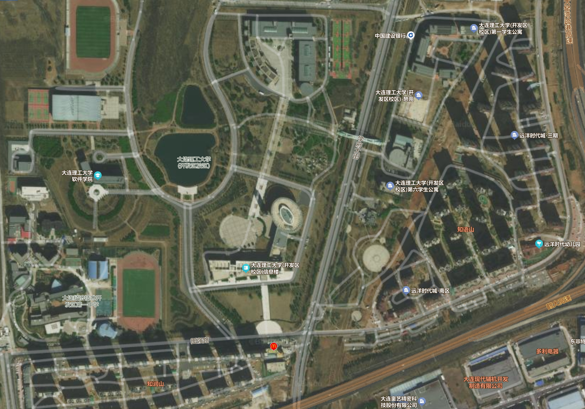

import { Aside } from "@astrojs/starlight/components";

祝贺你来到大连理工大学！随通知书邮寄到你手上的还有几个小册子，内容涉及到很多开学前你需要准备的东西，比如学生账号注册、银行卡办理、助学贷款申请等等等等，都很重要，务必仔细研读（据悉 2024 级新生录取通知书内无入学指南，请查看 [大连理工大学迎新网](https://yx.dlut.edu.cn/)）。

## 凌水校区

不知道

## 开发区校区

大连理工大学开发区校区是大连理工大学的多个校区之一，启用于 2004 年，与甘井子区凌工路2号的凌水校区同属于大连理工大学的大连主校区，和凌水校区为同一院校代码（与盘锦校区做区分）。

> 开发区校区和凌水主校区完全属于同一所大学，只是专业分布不同，毕业证、学籍等100%一致。下面解释几个概念：
>
> 1. 普通校区（同省市校区）
>
> 普通校区是指同一所高校在同一城市、省份内设立的不同教学区域，各校区在学籍管理、毕业证书、师资配置等方面完全统一，仅因校园容量或学科布局需要而分设不同地点。以大连理工大学为例，凌水主校区与开发区校区均隶属于校本部，招生代码一致，学生享受同等的教育资源与政策待遇。这种情况在985、211高校中十分常见，类似情况如北京大学的燕园校区、昌平校区，山东大学的中心校区、千佛山校区、趵突泉校区、洪家楼校区、软件园校区、兴隆山校区、青岛校区，等等。
>
> 2. 异地校区（跨市跨省校区）
>
> 异地校区是指高校在非主校区所在城市设立的办学机构，通常具有独立的招生代码，在学籍、学位授予等方面一般与校本部保持一致，师资配置、保研政策等一般不同，具体要看该校的政策。例如，哈尔滨工业大学（深圳）、大连理工大学（盘锦）、中国人民大学（苏州）等均属于此类。
>
> 3. 独立学院（民办分校）
>
> 独立学院是依托公办高校品牌设立的民办高等教育机构，具有独立的法人资格和办学资质。其招生、财务、学历颁发均与母体高校无关，毕业证书由独立学院自行颁发。例如，大连理工大学城市学院（目前正计划转设为大连工程学院）、厦门大学嘉庚学院等即属于此类。独立学院通常按民办机制运作，学费较高，录取批次多为本科二批或三批，与校本部一般无直接关联。

校区分为两个区：生活区（又叫憩苑，东区）和教学区（西区），通过横跨学府大街的天桥（学苑桥）连接，新生报道在生活区。

教学区有 ABC 三栋楼。

生活区目前有七栋宿舍楼，一到五舍在生活区北部，六舍在食堂南侧，七舍（新楼）在食堂北侧。

生活区有南门（正门）和旋转门（在生活区西北处，晚上 22:30 锁门）。教学区大门在学校南边临着图强路，信息楼正对的门不开，开的是西侧的大门。学校所有校门（旋转门除外）全天 24h 都可以刷卡刷脸进出，但是宿舍楼每晚 22:45 锁楼门，早上 5:30 再开。

### 生活区

宿舍为四人间上床下桌，独立卫生间+洗手间（洗脸台），（大部分宿舍有）独立阳台，有暖气，有空调。宿舍内洗手间无热水，楼道里有付费热水机。

床的尺寸是 1.9m×0.9m(部分 1.9×0.8，建议就按宽度 0.85m 处理)，学校发一个床垫，但是有点硬，可以自带床垫。两张床共用一个梯子(有点不方便)。夏天蚊子不多，可以不备蚊帐。

冬天宿舍比较暖和。宿舍内禁止使用小太阳/电吹风等超过 500W 的大功率或纯电阻发热式违禁电器（不过懂的都懂）。洗衣机和台式电脑不属于违禁电器管理范围。查寝有来自宿管/学生会和辅导员的，频率因级队而异，除军训期间外大概一月一到两次。

寝室每天 23:00~次日 5:30 断电，不断网。需要准备充电台灯和充电宝。没有起床铃休息铃，没有宿管巡查，熬夜没人管，一切全靠自觉。

宿舍开学前随机分配，优先同班级（同班级肯定同专业）分到一起，分不过来的再插到其他班级，四年内无特殊情况一般不进行宿舍更换（分到什么舍友就看人品了）。

每栋寝室楼在一楼有带有隔间的淋浴间（七舍淋浴间不在一楼），开放时间为每日 16:00-22:00 （周末 12:00-22:00） 不适应北方大澡堂的南方同学可以放心了。插校园卡取水，水温不可调（稍微有一点点烫），内有储物柜（无法上锁），需要准备小盆/小篮（放洗发露沐浴露等）毛巾等，淋浴间门口有公用吹风机。

PS：宿舍里可以自行购买洗澡神器，有时候有体育课/军训但是澡堂不开放可以在宿舍洗澡。

洗衣房在四舍大门对面，内部有若干台洗衣机和一台洗鞋机和一台烘干机，不想花钱洗衣服可以自行购买洗衣机装到宿舍洗手间（七舍似乎不可自行安装但七舍一楼有自己单独的洗衣房）。校内有理发店。邮寄物品和取快递均在三舍楼下快递驿站，快递收发还算方便。

**快递收货地址**：

- 辽宁省大连市金州区湾里街道图强路321号大连理工大学(开发区校区) + 憩苑快递驿站 / 生活区2舍丰巢柜 / 食堂丰巢柜 / 教学楼丰巢柜 / 信息楼丰巢柜 / 综合楼丰巢柜

生活区每个宿舍楼内一楼有自助打印机，但价格略贵，只建议救急使用，建议去下文提到的**教学区**打印。

### 教学区

运动场在教学区，过学苑桥一直往前走，从两个湖中间的路继续直走看到体育馆，运动场在体育馆右侧。篮球场在过学苑桥后直接右转的小路下去。图书馆在过学苑桥后左转第一条小路走到尽头。描述起来有点抽象，建议自行看地图。

<Aside>
  进体育馆需要另带一双运动鞋，不然不让进，还得跑回宿舍拿，所以不要忘记！！！
</Aside>

教学区在 A320 有 OurEDA 实验室提供的对外打印服务，价格不分黑白彩印均为单面 0.2r，双面 0.4r，基本等于白送。

在 A308 有设计组提供的对外打印服务，黑白单面 0.2r，双面 0.4r，彩印单面 1r，双面 2r。

图书馆二楼有自助打印的电脑和打印机。

此外 A308 设计组可以打印彩色照片，也可以拍证件照，拍照片电子版免费，洗照片 5r。

教学区里所有空教室都可以用来上自习，在教室外楼道里也有一些公用小桌可以用来自习和讨论；七舍一楼有休闲区域可以用于自习，且有三台电脑可以使用；然后就是图书馆，但是需要预约。无 24h 自习室，每天晚上 22:45 之前必须回宿舍，因为 22:45 宿管阿姨会锁宿舍大门。

图书馆 8 点开门开到 21:40，想自习的同学也可以去教学楼 B 区空教室。体育馆开放时间为工作日 17:00-20:30，休息日 12:00-20:30。体育馆三楼有健身房，进去要买票。田径场全天开放。
